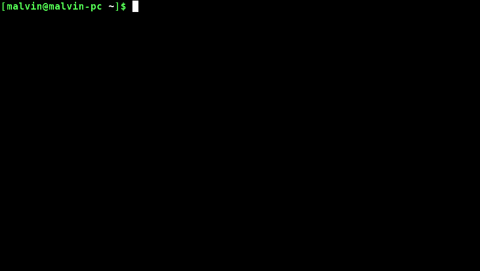

# DeviantArt Scraper

The easy way to download the highest resolution DeviantArt Galleries. For more information check this [article](https://mlvnt.com/blog/tech/2018/05/scraping-deviantart/).



## Requirements

**1. Install python dependencies:**

```
pip install -r requirements.txt
```

**2. Install Chromium:**

- Debian Based

    ```
    sudo apt install chromium-browser
    ```

- Arch

    ```
    sudo pacman -S chromium
    ```

**3. Download the Chrome Driver.**

- Download [Chrome Driver version 79](https://chromedriver.storage.googleapis.com/index.html?path=79.0.3945.36/)
- Copy `chromedriver` into the folder `deviantart-scraper`.


## Quick Start

To begin downloading images, use the following steps. Images will be downloaded into a default folder `images`. Additionally, a metadata file `gallery.txt` will be generated, containing the names of the files downloaded.

```bash
python3 deviantart.py
```

### Options

The following command-line arguments are supported.

```bash
python3 deviantart.py --help
```

```text
usage: devianart.py [-h] [-d DIR] [-f FILENAME] [-u URL] [-c COUNT] [-r]

optional arguments:
  -h, --help            show this help message and exit
  -d DIR, --dir DIR     Directory to store images. Default: ./images
  -f FILENAME, --filename FILENAME
                        Explicit base filename to use. Default: downloaded
                        filename
  -u URL, --url URL     DeviantArt gallery url to scrape images from. Default:
                        deviantart.com
  -c COUNT, --count COUNT
                        Maximum number of images to download. Default: 25
  -r, --random          Download a random image. Default: False
```

## Automatically Changing the Desktop Background Wallpaper

You can automatically download and set the desktop background wallpaper by using the command-line arguments with a [script](wallpaper.sh). The following example demonstrates this for Linux Mint.

```bash
#!/bin/bash

USER=$(whoami)
ORIGINAL_DIR=$(pwd)

# Delete cached wallpaper.
rm -f /tmp/wallpaper.*

# Download image.
cd /home/$USER/Documents/deviantart-scraper/
FILE_PATH=$(python3 devianart.py /tmp wallpaper 1 random | tail -1)
cd $ORIGINAL_DIR

# Delete cached wallpaper.
rm -f /home/$USER/.cache/wallpaper/*

echo "Downloaded $FILE_PATH"

# Set new wallpaper.
gsettings set org.gnome.desktop.background picture-options "zoom"
gsettings set org.gnome.desktop.background picture-uri file://$FILE_PATH
```

You can automatically run the above bash script via cron job with the following command.

```bash
crontab -e
```

Paste the following lines to the end of the cron file.

```
# Add a cron job to run this script every 15 minutes.
*/15 * * * * /home/YOUR_USER_NAME/Documents/wallpaper.sh
```

## License

The code is licensed under the MIT License.

> Disclaimer: All art you download using this script belongs to their rightful owners. Please support them by purchasing their art.